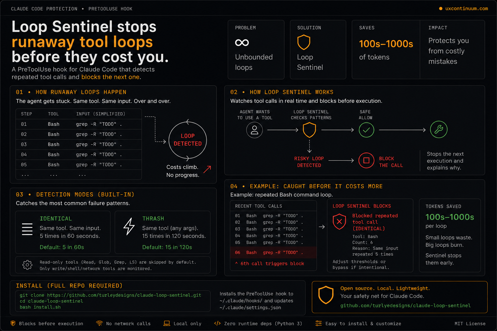

# Loop Sentinel



A tiny Claude Code hook that catches runaway tool-call loops before they keep burning tokens.

After the threads about [$6K overnight burns](https://github.com/anthropics/claude-code/issues/4277) and 62M tokens in 24h, this is a local circuit breaker for one of the dumbest ways to waste tokens: repeated agent loops.

## What it does

Installs a `PreToolUse` hook that tracks your agent's tool call patterns. When it detects a loop, it **blocks the next call** before it executes, not after.

Two detection modes:

| Mode | Trigger | What it catches |
|------|---------|-----------------|
| Identical loop | Same tool + same args, 5x in 60s | Agent stuck retrying the same failing command |
| Thrash loop | Same tool, 15x in 120s | Agent spinning through variations of a broken approach |

Read-only tools (`Read`, `Glob`, `Grep`, `LS`) are skipped by default because they are usually lower-risk than write/shell tools.

## What this does not do

Loop Sentinel is **not** a replacement for Anthropic billing limits, workspace limits, or provider-side spend controls. It does not monitor total token spend or API billing. It only blocks suspicious repeated Claude Code tool-call patterns before the next tool executes.

If you need account-level cost protection, set workspace usage caps in the Anthropic console. This tool sits one layer below that.

## Install

```bash
git clone https://github.com/turleydesigns/claude-loop-sentinel
cd claude-loop-sentinel
bash install.sh
```

The installer backs up your existing `~/.claude/settings.json` before modifying it.

## Verify install

```bash
cat ~/.claude/settings.json
```

You should see a `PreToolUse` hook pointing to `~/.claude/hooks/loop-sentinel.py`.

To prove it actually blocks loops:

```bash
bash test/test_sentinel.sh
```

31 assertions covering identical-loop block, thrash-loop block, read-only skip, session isolation, and block payload shape.

## What it looks like when it fires

```
Loop Sentinel blocked 'Bash': called 6x with identical args in 47s.
This is a runaway loop. Stop, reassess the approach, and try a different strategy.
```

Claude Code receives this message, stops the tool call, and surfaces it to you before more tokens burn.

## Tuning the thresholds

Edit the constants at the top of `hooks/loop-sentinel.py`:

```python
IDENTICAL_LIMIT  = 5    # calls with same args before blocking
IDENTICAL_WINDOW = 60   # seconds window for identical check
THRASH_LIMIT     = 15   # calls any args before blocking
THRASH_WINDOW    = 120  # seconds window for thrash check
```

For long-running agentic tasks where some repetition is expected, raise `THRASH_LIMIT` to 25.

## How it works

- **PreToolUse hook** fires before every tool execution
- Writes `{timestamp, tool_name, args_fingerprint}` to a per-session temp file (SHA-256 of full normalized input)
- Reads back the last N seconds of history for this session
- If thresholds are exceeded, outputs `{"decision": "block", "reason": "..."}` and exits with code 2
- Claude Code enforces the block at the runtime level, the tool does not execute

The temp file is pruned to the last 10 minutes automatically. Sessions are isolated by `session_id`.

## Uninstall

```bash
bash uninstall.sh
```

## Why hooks, not CLAUDE.md

`CLAUDE.md` instructions can be overridden by Claude. A `PreToolUse` hook with exit code 2 cannot. It is enforced at the runtime level regardless of what is in the context window.

---

Built by [Matt Turley](https://uxcontinuum.com) / [RelayPlane](https://relayplane.com) for real-time agent cost monitoring.
